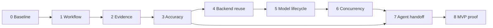

# Phraseback MVP Optimization Implementation Plan

> **For agentic workers:** REQUIRED SUB-SKILL: Use superpowers:executing-plans to implement this plan task-by-task. Steps use checkbox (`- [ ]`) syntax for tracking. This document authorizes planning only; execution and any delegation require the user's instruction. Resolve the skill through the available catalog rather than assuming the alias is installed.

**Goal:** Make recording, selecting evidence, describing it and handing it to an agent fast enough for regular use, while preserving factual accuracy and original evidence.

**Architecture:** Improve the existing Rust/Electron pipeline incrementally. Rust remains the sole durable writer; React consumes revisioned committed results and keeps draft edits separate. Reuse verified evidence and model resources, overlap bounded independent work, and provide a prompt-and-PNG package without requiring GIF encoding.

**Tech Stack:** Rust 1.98.1; Electron/React/TypeScript; Node 24.20.0; existing pinned local llama.cpp b10985 CPU/Vulkan runtime and model presets; lossless PNG evidence; version-1 projects.

**Spec:** This proposed product roadmap implements the user's October 8 request and the 16 findings in [the performance audit](../../audits/2026-10-07-recording-prompt-performance.html). Existing boundaries remain [SCOPE.md](../../SCOPE.md), [DEVELOPMENT.md](../../DEVELOPMENT.md) and the applicable AGENTS.md files. The new product targets below are proposals, not amendments to existing acceptance or evidence that MVP has passed.

## Global Constraints

- Preserve version-1 projects, original PNGs, journal ordering, Qt-compatible exclusive locking and manual descriptions. Preserve user changes and release backups; do not delete recordings or model assets.
- Keep processing local. In this plan, “transcription” means written snapshot descriptions. Audio transcription, OCR, cloud inference, imports, updaters and direct agent integrations are outside scope.
- Snapshots are saved during recording. There is no post-recording video-decoding stage to optimize in the active implementation.
- Preserve the compact dark Review design, evidence canvas, breadcrumb picker, timeline, moment strip and contextual details. Add the primary preparation action within that design.
- Never run capture, decode, hashing, inference or export work on the UI dispatcher. Keep the renderer without Node access and privileged operations behind typed preload/IPC.
- Keep sequential IPC requests, the four-byte little-endian UTF-8 framing, the 8 MiB message maximum, protocol-only stdout and content-free diagnostics.
- Preserve PNG-before-journal-before-publication durability. Saved acknowledgements follow successful persistence; coalesced progress cannot substitute for them. Drain saved acknowledgements before terminal operation state.
- Keep recording/revision checks, bounded queues, cancellation, shutdown deadlines and forced child cleanup. Preserve full interrupted-recording recovery and containment checks at trust boundaries.
- Supported capture is SDR/sRGB, with an 8 FPS target at the reference 2560 × 1600 display. Retain the explanatory HDR rejection. Do not add 4K, HDR, clean-Windows, Linux/macOS, accessibility, display-interruption or offline checks as completion gates.
- Each disruptive native test process must finish within 30 seconds. Normal user recordings remain uncapped. Use non-disruptive synthetic endurance and headless real inference for longer experiments.
- Preserve the 128 MiB full-resolution CPU capture-buffer budget and separate 128 MiB decoded-image budget. Account for encoder, GPU, model and transformed-image allocations separately.
- Use isolated data under `.tmp/`, never the real user library. Keep candidate builds isolated until separately authorized promotion; canonical portable output remains `dist/Phraseback`.
- Each cross-component change gets focused regression checks followed by `./build.ps1 -Task Check`, `Test` and `Build`. Source, native UI, real inference, receiving-agent and packaged evidence remain separate.
- Do not commit, amend, push or stage unrelated changes without explicit authorization. A task ends with a reviewable diff and passing checks; commit only when separately requested.

## Review Focus

1. **Edit → prepare while autosave is running:** dispatch against the successfully saved revision; failed saves retain the draft and prevent generation. Owned by Task 1A.
2. **Cancel, switch recordings or close during generation:** retain completed durable descriptions, reject late results for another recording and clean up children. Owned by Tasks 1B and 6A.
3. **Brief or tiny critical screen states:** include readable evidence of validation errors and confirmations; do not let grouping or resizing erase them. Owned by Tasks 2A and 3A.
4. **Replaced/missing originals or changed model assets:** caches cannot mask missing evidence, stale context or tampered assets; text-only save optimization cannot weaken containment. Owned by Tasks 4A, 4B and 5A.
5. **Agent cannot access the original library:** the selected-PNG package remains usable after relocation; prompt copy failures and pending descriptions are visible. Owned by Tasks 7A and 7B.

---

## Delivery sequence and usable outcomes

Each phase ends with a working application improvement and its evidence. Nothing requires completing a system rewrite first. Phase 0 improves diagnosis; Phases 1–7 improve user-facing behavior; Phase 8 proves the combined product.

| Phase | Main outcome | Audit findings | Depends on | Work size |
| --- | --- | --- | --- | --- |
| 0 — Baseline and product gates | Repeatable speed and quality scoreboard | F16, F01 | Existing audit | Medium |
| 1 — Direct preparation and live review | One preparation action; correct revisions; saved results appear immediately | F02, F03, F04, F12, F14 | 0 | Large |
| 2 — Evidence coverage | Useful moments retain brief errors, confirmations and small changes | F10, F11, F13 | 0, 1 | Large |
| 3 — Reliable local descriptions | A measured quality profile and honest descriptions | F01, F08 | 0, 2 | Large |
| 4 — Backend reuse and recording scale | Cached preparation and text saves avoid repeated image/file work | F05, F06, F11, F12, F14 | 1, 2, 3 | Large |
| 5 — Model lifecycle and hardware | Reuse warm verified resources and select an appropriate local backend | F07, F08 | 3, 4 | Medium–large |
| 6 — Bounded concurrency | Preparation overlaps inference without changing evidence or commit order | F09 | 1, 4, 5 | Medium |
| 7 — Agent-ready handoff | Portable prompt and selected PNGs without waiting for GIF export | F15, F04 | 1, 3, 4 | Medium |
| 8 — MVP validation | Practical end-to-end use, quality, speed and recovery proven together | All | 0–7 | Medium |

The table is the preferred execution order. Task 7A can move forward after Phases 1 and 3 if image handoff is blocking practical use; its final performance comparison waits for Phases 4–6. Phase 2B capture changes and Phase 6B multiple inference slots are conditional experiments, not mandatory architecture changes.

### What the audit establishes—and what remains unproven

The October 7 audit used the current application sources, synthetic isolated recordings and real local inference. On October 8, all 19 audited source hashes still matched. Timings below are observations, not promised performance:

- At 4,800 synthetic frames and two selected moments, opening took approximately **1.40 s median**, a text edit/save **1.65 s**, and descriptor organization **1.74 s**. Warm filesystem and hardlinked synthetic images limit generalization.
- A fully cached 12-moment batch at 2560 × 1600 took **2.22 s median**, including approximately **2.00 s image preparation**. Cache reuse still performed image work.
- The 2B GPU model missed the required-name error in the tested fixture. The 8B GPU model read it correctly in two cold runs and correctly described a distinct rename moment. This establishes a failure case, not broad model accuracy.
- The distinct warm 8B moment took **10.66 s**; cold 8B runs varied from **16.36 s to 36.11 s**. The 0.88 s warm 2B result repeated identical input and is not a general throughput baseline. The 4B preset was not tested.
- Historical packaged capture passed short-run acceptance. Fresh native capture, a broad accuracy corpus, a complete packaged preparation journey and receiving-agent handoff remain unproven.

Reference hardware: i7-14650HX, 31.61 GiB RAM, RTX 5050 Laptop GPU with 8,151 MiB dedicated memory. An 8B fixture succeeded on this machine, but model fit, sustained allocation and shared-memory spill must still be measured.

### Scoreboard and proposed product targets

Measure these separately: **Stop → interactive evidence**, **Stop → selected set**, **Prepare → first durably saved description visible**, **Prepare → complete usable prompt**, **handoff → agent opens all selected images**. Include explicit user click delay separately; do not hide it inside engine timings.

Existing approved limits remain mandatory: effective samples ≥7.6/s; Stop → interactive Review p95 ≤1 s; cached seek p95 ≤100 ms; uncached seek p95 ≤250 ms on the reference SSD; the two separate 128 MiB budgets.

The following are proposed optimization targets. Freeze benchmark definitions in Phase 0. Freeze the accuracy-qualified model and end-to-end comparison baseline in Phase 3, before optimizing Phases 4–6. Record a target miss and its tradeoff explicitly; do not lower accuracy, shrink the selected set or silently revise the target to declare success.

| Proposed target | Fixture and evaluation | Owner |
| --- | --- | --- |
| One primary action from stopped recording to preparation | No mandatory Organize → Generate → Get prompt sequence; review and curation remain available | Phase 1 |
| All labelled critical states have selected readable evidence | 40 development moments plus 20 held-out moments; temporal and tiny-state cases included | Phase 2 |
| No critical-message or unsupported-action failures on the held-out set; ≥95% labelled fact precision and recall | Score factual claims, exact task-critical text and uncertainty against human labels; compare per category, not just aggregate | Phase 3 |
| Cached 12-moment preparation ≤500 ms median at 2560 × 1600 | Same selected evidence, hot description cache, 20 repetitions; zero model launches and zero image transforms on verified cache hits | Phase 4 |
| 4,800-frame text save ≤100 ms median and ≤200 ms p95 | Two selected moments, 30 repetitions; preserve durable acknowledgement and crash recovery | Phase 4 |
| Saved-description acknowledgement → visible result ≤250 ms p95 | Instrument actual UI rendering on 30 updates under load, including Prompt view | Phase 1/4 |
| Warm quality-qualified 12-moment completion ≥30% faster than the Phase 3 baseline | 30 distinct-input batches, fixed model, output policy, evidence and selected count; compare p50 and p95 and account for all startup/preparation/save time | Phase 6/8 |
| Prompt-and-selected-PNG package ≤1 s p95 | 12 selected 2560 × 1600 PNGs on the reference SSD, 30 repetitions, publish complete package atomically; exclude receiving-agent upload time | Phase 7 |
| All images accessible; ≥9 of 10 representative agent tasks succeed | Relocated package, user-chosen receiving agent, frozen task rubric; missing-image or unsafe unsupported-claim failures fail the gate | Phase 7/8 |

Absolute inference budgets must come from Phase 3's qualified model measurements. The small existing audit cannot justify a universal “first answer in N seconds” promise. A relative improvement alone is insufficient for MVP: Phase 8 also records actual wait times and whether the user finds them acceptable for regular use.

## Phase 0 — Baseline and product gates

**Outcome:** A repeatable dashboard explains where time goes and pairs every performance result with quality. **Findings:** F16; establishes F01 evaluation. **Depends on:** audit. **Exit:** baseline artifact, corpus and gate definitions are reproducible without touching normal user data.

### Task 0A — Instrument the complete journey

**Files:** Modify `packages/engine/crates/flow-engine/src/generation.rs`, `model.rs`, `operation.rs`, `recording.rs`, `main.rs`; `packages/ui/src/renderer/App.tsx`, `workspace.ts`; relevant schemas/golden messages in `packages/engine/contracts/`. Create `packages/engine/crates/flow-engine/src/performance.rs`, `packages/ui/src/renderer/performance.ts` and `scripts/benchmark_prompt_pipeline.mjs`. Tests live beside the new modules and in `packages/ui/src/main/contracts.test.ts`.

**Interfaces:** A content-free `StageSpan` has `trace_id`, `stage`, `started_ms`, `duration_ms`, `cache_hit`, `backend` and numeric counters. Use monotonic clocks per process; record round-trip boundaries rather than subtracting unrelated clock origins. UI `markVisible(traceId: string, revision: number, kind: 'evidence' | 'description' | 'prompt'): void` records the committed view after render. The harness produces `.tmp/mvp-benchmarks/<run>/results.json` with source/build/runtime hashes, hardware, fixture, phase spans, wall time and quality references.

- [ ] Add failing tests `spans_exclude_content`, `overlap_is_not_double_counted` and `saved_visibility_requires_committed_revision`; assert no image bytes, screen text, prompts, descriptions, tokens or sensitive paths in diagnostics.
- [ ] Run the focused Rust performance tests and UI performance/contract tests; verify these assertions fail against the uninstrumented behavior.
- [ ] Add spans for finalization, catalog delay, prepare/open, metadata, selection, identity, transform, asset verification, extraction, model load, vision/prefill/decode where the pinned response exposes them, cache write, project save, acknowledgement, paint and packaging. Keep unexposed timing fields explicitly unavailable.
- [ ] Run the focused tests to green; collect cold-process, warm-model/new-input, fully cached and cancellation runs. Report sample counts; reserve p95 comparisons for at least 30 independent observations.

### Task 0B — Define a reproducible quality and usability corpus

**Files:** Create `packages/engine/fixtures/prompt-quality/manifest.json`, `labels.json`, `README.md`, original synthetic PNG fixtures and `scripts/evaluate_prompt_quality.mjs`. Extend engine integration tests in `packages/engine/crates/flow-engine/tests/prompt_pipeline.rs` and create `docs/audits/mvp-validation.md` as the execution evidence ledger.

**Interfaces:** Each labelled moment records ordered evidence IDs/timestamps, required visible facts, forbidden causal/action claims, critical text and acceptable uncertainty. Manifest separates 40 development and 20 held-out moments; a separate list defines 10 agent tasks with binary success criteria. Evaluation output records model/prompt/selection versions, fact precision/recall, critical-state coverage, unsupported claims, latency and human adjudication.

- [ ] Implement evaluator checks that deliberately wrong labels/results fail: missed required-name error, fabricated click, unreadable transient state and missing image.
- [ ] Cover form validation, tiny text, short confirmations, repeated cursor-only movement, loading/success/error transitions, ambiguous causality, manual corrections, missing evidence and task-context changes. Build all fixture data synthetically or from explicitly authorized test content.
- [ ] Run the current application/profile against the corpus and sizes 48/480/4,800 frames, with 2/12/50 selected moments as separate dimensions. Do not treat the old two-moment metadata benchmark as a large generation benchmark.
- [ ] Publish a baseline with failures intact and frozen target definitions. Keep held-out labels out of tuning decisions; a failed gate requires a new version and fresh evaluation, not tuning repeatedly against the holdout.

**Manual check:** Open the trace for edit → prepare and locate user wait, model work, save and visible-result boundaries. Confirm the audit's required-name failure is scored as a failure.

## Phase 1 — Direct preparation and live review

**Outcome:** Stop opens evidence promptly; one **Prepare prompt** action selects moments, describes missing/stale moments and opens a fresh prompt. Completed work appears while the batch continues. **Findings:** F02, F03, F04, early F12/F14. **Depends on:** 0. **Exit:** the complete path works with edits, cancellation and saved partial results, using the current selection/model behavior.

### Task 1A — Fix revision races and orchestrate preparation

**Files:** Modify `packages/ui/src/renderer/App.tsx`, `workspace.ts`, `recovery-draft.ts`; create `packages/ui/src/renderer/prepare-prompt.ts`, `prepare-prompt.test.ts`, `App.test.tsx`; update `workspace.test.ts`. Modify `packages/engine/crates/flow-engine/src/main.rs` and `organize.rs` only where necessary to distinguish untouched from curated selection.

**Interfaces:** `preparePrompt(context: PreparationContext): Promise<PreparationOutcome>` lives in the UI coordinator. `PreparationContext` supplies typed existing requests, `flushDraft(): Promise<boolean>`, `current(): Snapshot | null`, cancellation and stage callbacks. `PreparationOutcome` distinguishes completed, cancelled, failed and recording-changed. Capture the intended recording and optional step ID before flushing; derive its latest revision only after a successful flush and identity recheck. Existing Organize → revision-checked apply → Generate → Render commands remain the engine boundaries.

Use the audit's headless Chromium/mocked-preload approach for App component interaction tests, integrated with the existing Vitest runner. Reuse installed build/browser tools rather than assuming an uninstalled React testing framework or treating mocked interactions as native evidence.

- [ ] Add failing tests `prepare_after_dirty_draft_uses_saved_revision`, `prepare_waits_for_inflight_autosave`, `save_failure_keeps_draft`, `recording_switch_rejects_old_target`, and `curated_selection_is_not_replaced`. Include regeneration and export, which share the race.
- [ ] Run the focused UI tests and confirm the old revision failure reproduces.
- [ ] Implement the coordinator: flush; recheck identity; finish/reuse organization for untouched automatic selection; apply at the current revision; describe pending/stale/failed non-manual moments; render the latest committed prompt. Do not cancel organization merely because generation was requested, or infer “curated” merely from non-empty generated descriptions. Persist a backward-compatible provenance marker for future changes; conservatively preserve ambiguous legacy selections.
- [ ] Place the primary action in the approved compact layout. Keep manual Organize/regenerate available contextually; do not require users to discover those menus to get a prompt.
- [ ] Open the finalized recording directly before an independent catalog refresh. Preserve cancellable `prepare_open` and publish only its completed snapshot. Use the full loader initially; Phase 4 introduces safe paging.
- [ ] Run the focused tests to green and check the native edit → preparation flow in an isolated, bounded UI test.

### Task 1B — Publish durable revisions progressively

**Files:** Modify `packages/engine/crates/flow-engine/src/generation.rs`, `main.rs`, `operation.rs`; create `committed_project.rs` and tests within the engine crate. Modify `packages/engine/contracts/operation.notification.json` and associated schemas/golden cases, `packages/ui/src/renderer/App.tsx`, `workspace.ts`, `prepare-prompt.ts`. Extend `App.test.tsx`, `workspace.test.ts` and `packages/ui/src/main/real-engine.test.ts`.

**Interfaces:** `CommittedUpdate = { recording_id: string; revision: number; step: Step }` is an engine-issued durable update. Rust publishes the latest successfully persisted project revision to the read side; it does not create a second writer. UI `applyCommittedUpdate(snapshot: Snapshot, update: CommittedUpdate): Snapshot` merges only matching identity and valid revision order. Gaps trigger a latest-committed snapshot read rather than guessing. `render_prompt` reads that committed state during generation; local unsaved drafts remain separate.

- [ ] Add failing tests `saved_update_precedes_terminal`, `prompt_reads_latest_durable_revision`, `cancel_retains_completed_steps`, `dirty_draft_survives_update`, `late_update_cannot_change_other_recording` and `prompt_view_survives_completion`.
- [ ] Run focused engine/UI contract tests and confirm the stale prompt/counter-only behavior fails.
- [ ] Publish saved steps after persistence and merge them in Review and Prompt views. Keep navigation stable on completion. Distinguish pending, stale, failed, generated and reviewed content; “generated” must not imply human review or factual verification.
- [ ] Keep one writer: draft edits can remain local during generation; authoritative saves wait for the generation writer to stop or finish. Rebase only unrelated committed changes; an altered target step requires explicit conflict resolution. Show unsaved/queued state and preserve recovery drafts on failures.
- [ ] Key previews by recording/evidence/frame/dimensions rather than text/review changes. Retain the last valid image only for the same evidence identity; switching recordings must never show an old recording's image.
- [ ] Verify acknowledgement → visible result against the proposed 250 ms p95 target and run focused tests to green. Cancellation leaves an honest partial prompt and already saved descriptions.

**Manual check:** Type a correction and immediately prepare; navigate to Prompt while generation continues; cancel after a saved result; resume. Confirm the correction, selection, displayed evidence and partial prompt remain consistent. No per-moment review requirement is added; review before export remains available and the package communicates review status.

## Phase 2 — Evidence coverage and useful snapshot sets

**Outcome:** Automatic selection catches brief, small and meaningful changes while avoiding cursor-only repetition. Users can inspect and curate every selected moment. **Findings:** F10, F11, measurement-dependent F13. **Depends on:** 0, 1. **Exit:** the corpus's critical states are represented by readable original evidence, and repeated organization reuses valid derived work.

### Task 2A — Improve selection and descriptor reuse

**Files:** Modify `packages/engine/crates/flow-core/src/selection.rs`, `packages/engine/crates/flow-engine/src/organize.rs`, `recording.rs`; create `packages/engine/crates/flow-engine/src/descriptor_cache.rs`. Add tests alongside these modules and labelled temporal cases to `packages/engine/fixtures/prompt-quality/`.

**Interfaces:** A versioned `DescriptorKey` includes source content identity, dimensions, descriptor algorithm and cursor-treatment provenance. `DescriptorCache::get_or_build(key, source, work)` returns a validated derived descriptor. Selection produces ordered suggestions and a coverage report tied to recording/revision; only `apply_organization` changes authoritative selected moments.

- [ ] Add failing tests `tiny_validation_change_retained`, `brief_confirmation_retained`, `cursor_only_changes_not_overselected`, `fallback_descriptor_is_reused`, `algorithm_change_invalidates_cache`, `legacy_cursor_provenance_preserved` and `manual_selection_survives_reanalysis`.
- [ ] Run focused selection/organization tests; confirm the low-resolution descriptor failure cases.
- [ ] Compare the existing 320-pixel descriptor with deterministic multi-scale/tile changes and short transition windows. Retain before/after/critical states and chronological order. Optimize coverage first, then minimize selected count subject to that coverage; do not describe every sampled frame.
- [ ] Persist rebuilt fallback descriptors atomically and reuse compatible suggestion/descriptor results. Preserve legacy/source cursor semantics; record unavailable cursor-free information honestly.
- [ ] Run selection against development fixtures and held-out coverage cases. Keep original PNGs unchanged. Evaluate rare transitions separately from static screens and report selected count, recall, latency and cache hits together.

### Task 2B — Profile capture and remove only measured critical-path work

**Files:** Instrument `packages/engine/crates/flow-capture-windows/src/native.rs` and `packages/engine/crates/flow-engine/src/recording.rs`; extend `packages/ui/scripts/native-capture.mjs`, `scripts/rebuild_encoder_memory.ps1`, `scripts/rebuild_endurance_check.ps1` where required. Do not change the recording format.

**Interfaces:** Capture measurements expose readback/copy/cursor/descriptor/encode/image-sync/journal-sync/drain spans, pool occupancy and missed samples. If disposable derived work is offloaded, use a bounded producer queue and the Phase 2A cache; recovery must tolerate missing derived entries.

- [ ] Establish current short native stage timings and synthetic endurance memory plateaus. Keep each disruptive test process ≤30 seconds and use the reference SDR display and smaller region.
- [ ] If descriptor writes, duplicate copies or encoding materially dominate, add a failing bounded-queue/durability test for the selected change before implementation. Move disposable descriptor persistence off the buffer-recycle path first if the trace supports it.
- [ ] Compare PNG compression/filter or copy changes only if profiling warrants them. Require identical decoded pixels, unchanged sample accounting and durable ordering. Retain the existing two concurrent encoder threads unless measurements justify a change.
- [ ] Re-run sampling, Stop → Review, memory and interruption/recovery checks after any capture modification. If capture already meets limits and does not constrain end-to-end use, close this task with the trace and a documented no-change decision.

**Manual check:** Record a brief error and a quick confirmation, inspect their selected original pixels, and deliberately add/remove a moment. Reorganizing must preserve the user's curation.

## Phase 3 — Reliable local descriptions

**Outcome:** The selected quality profile describes visible facts and uncertainty accurately enough to use in an agent prompt. **Findings:** F01, quality side of F08. **Depends on:** 0, 2. **Exit:** a quality-qualified profile and fixed end-to-end comparison baseline; a fast failing model does not qualify.

### Task 3A — Evaluate models, image fidelity and description policy

**Files:** Modify `packages/engine/crates/flow-engine/src/generation.rs`, `packages/engine/contracts/model-presets.json` only for validated preset metadata, `packages/engine/fixtures/prompt-quality/` and the Phase 0 evaluator. Add real-model opt-in cases in `packages/engine/crates/flow-engine/tests/prompt_quality.rs` and engine description-policy tests.

**Interfaces:** A versioned `GenerationProfile` binds preset, ordered evidence policy, transform version, prompt/schema version and grounding policy. `QualityResult` binds that exact profile to category scores and raw numeric timing references. Do not interpret JSON validity or a model's self-reported uncertainty as a fact verifier.

- [ ] Preserve the required-name error regression and add `unsupported_click_is_rejected_by_evaluation`, `critical_text_survives_transform`, `initial_state_avoids_invented_action` and `manual_description_is_not_regenerated`.
- [ ] Compare existing 2B and 8B profiles on the development corpus. Evaluate 4B only after its existing verified assets are available; model downloading/installing is a separate explicit execution decision. Unavailable 4B is recorded, not a completion blocker.
- [ ] Compare current full-frame resize with fidelity-preserving alternatives for task-critical small regions. Keep ordered full-frame context and original pixels; any additional crop is derived evidence tied to the original. No OCR expansion. Do not shrink images or tokens solely to win latency.
- [ ] Tune description instructions to separate observable state, supported changes and unknown causality. Preserve exact visible critical messages; do not infer that a click, save or backend write occurred merely from a UI label.
- [ ] Evaluate the frozen chosen profile once on the held-out set. Apply the proposed quality gates per category. If none qualify, keep the roadmap at this exit and improve evidence/prompt/model quality; do not mark the product ready because a larger model looked better on two examples.

### Task 3B — Select a safe product policy and freeze its baseline

**Files:** Modify `packages/engine/crates/flow-engine/src/model.rs`, `preferences.rs`, `generation.rs`; `packages/ui/src/renderer/App.tsx`; extend model/description tests and `docs/audits/mvp-validation.md`.

**Interfaces:** Profile selection returns an explicit qualified preset/backend or a reason it cannot run. Existing user model selections remain respected. Generated status, review status, profile version and staleness remain distinguishable. Any larger-model retry is bounded and recorded against the same evidence; automatic routing is enabled only if it passes the corpus.

- [ ] Choose the simplest policy that passes: one qualified default with explicit user alternatives. Do not ship an uncertainty-based fast-model cascade unless independently measured routing catches the fast model's errors; the model's confidence alone is insufficient.
- [ ] Retain explicit GPU failure behavior and actionable local setup. Do not silently switch to CPU or present an unqualified profile as equivalent. Keep manual correction and explicit regeneration paths.
- [ ] Measure first correct visible description and complete prompt for fixed 2/12/50-moment sets. Record warm **different-input** and cold-process runs separately, including total wait, failed cases, memory and source/profile hashes.
- [ ] Freeze the quality-qualified 12-moment baseline for Phases 4–6. Run focused tests and record the quality gate with human grading evidence.

**Manual check:** Review model descriptions of the error, confirmation, rename and ambiguous-action cases. Correct one manually and regenerate the batch; the correction remains intact. Compare two presets without losing the recording or task context.

## Phase 4 — Backend reuse and large-recording responsiveness

**Outcome:** Repeated descriptions avoid unnecessary decoding/encoding, text saves do not scan all original paths, and large recordings become interactive before full metadata hydration. **Findings:** F05, F06, F11, F12, F14. **Depends on:** 1, 2, 3. **Exit:** cache/save targets are measured, evidence trust is retained and large-recording UI checks pass.

### Task 4A — Validate evidence once, keep durable text saves cheap

**Files:** Modify `packages/engine/crates/flow-core/src/project.rs`; create `packages/engine/crates/flow-engine/src/evidence_session.rs`; modify `generation.rs`, `main.rs`, `committed_project.rs`. Tests in the core project module, `packages/engine/crates/flow-engine/tests/prompt_pipeline.rs` and existing startup/recovery tests.

**Interfaces:** `EvidenceSession` is an unforgeable engine-owned capability tied to canonical recording directory, successfully validated originals and source identities. A description-only commit validates changed fields/dependencies and serializes version-1 metadata durably without rescanning all N frame paths. Evidence access still checks containment and original identity; open/recovery/export trust boundaries retain appropriate validation. Public general-purpose `Project::save` remains safe for unvalidated callers.

- [ ] Add failing tests `description_save_does_not_rescan_all_frames`, `failed_save_preserves_revision`, `missing_original_cannot_be_hidden`, `reparse_substitution_rejected`, `crash_after_commit_recovers_description` and `invalid_text_mutation_rejected`.
- [ ] Implement the validated text-only commit path while retaining atomic persistence and required syncs. Keep full version-1 serialization initially; introduce no sidecar authoritative database or batched unsynced acknowledgements.
- [ ] Benchmark the 4,800-frame/two-moment save fixture and 50-moment generation separately. Check durable restart behavior and proposed ≤100 ms median/≤200 ms p95 text-save targets.
- [ ] Run focused core/engine recovery tests to green. If whole-project serialization remains dominant, record its measured cost before proposing a later format amendment; do not fold that rewrite into this task.

### Task 4B — Check description cache before image transforms

**Files:** Split reusable image input work from `packages/engine/crates/flow-engine/src/generation.rs` into new `generation_input.rs`; use `evidence_session.rs`, `descriptor_cache.rs` and profile versions from Phase 3. Add engine cache tests and benchmark cases.

**Interfaces:** `InputIdentity` contains ordered source content digests, image roles/timestamps, relevant task/context, selection dependencies, preset/weight/projector/runtime identity, transform version, prompt/schema and grounding versions. `PreparedInput` is constructed only on a description-cache miss. Memoized digests are valid only while the engine's verified source identity remains valid. Derived transformed PNG caching has explicit byte/accounting/eviction limits and is disposable.

- [ ] Add failing tests `cache_hit_skips_decode_resize_encode`, `force_bypasses_description_cache`, `context_or_evidence_change_misses_cache`, `same_pixels_different_role_misses_cache`, `missing_original_rejects_cached_description` and `manual_text_is_preserved`.
- [ ] Compute cheap verified identity before building the model payload; return validated cached descriptions without transforms. Memoize source digests in the evidence session and optionally derive them during authoritative capture persistence.
- [ ] Add a bounded transformed-image cache for actual misses/retries, keyed by complete transform identity. Keep original resolution/fidelity decisions from Phase 3 and record transformed-cache memory separately.
- [ ] Verify fully cached 12-moment runs launch no model and transform no image; measure the ≤500 ms median target. Inspect invalidation after task/context, profile and source changes.

### Task 4C — Page metadata and avoid redundant rendering

**Files:** Modify `packages/engine/crates/flow-engine/src/main.rs`, `preview.rs`; `packages/ui/src/renderer/workspace.ts`, `App.tsx`, `playback.ts`; create `paged-recording.ts`, `paged-recording.test.ts`. Extend `workspace.test.ts`, `playback.test.ts`, `packages/ui/scripts/native-review-performance.mjs`.

**Interfaces:** `loadRecordingInitial(...)` returns completed prepared header, selected moments and selected evidence metadata; `loadMetadataPage(...)` returns a revision-bound indexed page. `PagedRecording` distinguishes missing pages from empty recordings and requests timeline pages by viewport/seek. Do not populate a supposedly complete `Project.frames` array with sparse/null entries. Playback resolves frame metadata asynchronously and cancels by recording/session identity.

- [ ] Add failing tests `first_evidence_does_not_wait_for_all_pages`, `stale_page_is_discarded`, `seek_loads_needed_page`, `same_frame_edit_does_not_refetch`, `switch_recording_never_shows_old_preview` and `missing_original_rejects_orphan_preview`.
- [ ] Use indexed engine slices instead of repeated offset iteration. Preserve sequential IPC, cancellable prepared open and full recovery validation. First interaction waits for safe prepared state, not every metadata page or catalog refresh.
- [ ] Memoize/virtualize large moment sets, deduplicate pending preview work and avoid completion-time full reloads. Enforce the separate decoded-image budget and valid evidence keys.
- [ ] Measure 48/480/4,800-frame opens at 2/12/50 moments: first safe interaction, total hydration, page count, bytes, UI dispatch under generation and seek percentiles. Run source tests and bounded native review checks.

**Manual check:** Open a large synthetic recording, seek immediately, edit the selected description and switch recordings while metadata arrives. The image stays correct, text edits do not blank it, and cancellation remains responsive.

## Phase 5 — Model lifecycle and hardware utilization

**Outcome:** Compatible verified model resources stay warm for Review and reuse; hardware setup has clear, measured behavior. **Findings:** F07, runtime side of F08. **Depends on:** 3, 4. **Exit:** startup/load work is reduced without changing the qualified output policy, weakening integrity or exceeding measured memory.

### Task 5A — Reuse verified assets and manage runtime lifetime

**Files:** Modify `packages/engine/crates/flow-engine/src/model.rs`, `main.rs`, `child.rs`, `preferences.rs`; create `model_session.rs`; extend model tests, `packages/ui/scripts/native-model-lifecycle.mjs`, `native-model-verify.mjs`, `native-model-cancel.mjs`.

**Interfaces:** `ModelSession` binds verified asset identities, extraction/runtime version, preset/backend, process ownership and last use. `ensureReady(profile, work)` reuses only a compatible verified session. `release()` remains explicit and bounded; asset selection/change, integrity failure and shutdown invalidate the appropriate resources.

- [ ] Add failing tests `verified_session_avoids_repeat_full_hash`, `modified_asset_requires_reverification`, `wrong_runtime_extraction_not_reused`, `release_removes_child`, `prewarm_cancel_is_bounded` and `recording_start_releases_if_budget_requires`.
- [ ] Reuse verified extraction and in-process cryptographic verification state while retained verified asset handles deny write/delete sharing. Release or invalidation of those handles ends the verification lease and requires full cryptographic verification before reuse. Include weights, projector and extracted runtime files in the trust policy; size/mtime alone are not proof of integrity. Test that the pinned runtime can open the retained read-only assets; if it cannot, retain full verification and report the remaining cost rather than introduce a weaker trust shortcut. Do not add a cross-process “trusted” stamp without demonstrated replacement/tampering semantics.
- [ ] Replace unconditional short idle eviction with a measured Review lifetime policy. Prewarm only after Stop, overlapping safe organization; pause/cancel it for capture or memory pressure. Keep explicit Release model memory and recording priority. Retain runtime across capture only if resource measurements show this is safe; otherwise release and reuse verification/extraction next time.
- [ ] Measure separate verification, extraction, load and inference stages across repeated recordings, model changes, explicit release and idle expiry. Verify child cleanup and memory plateau. Compare cold/new-process and warm sessions separately.

### Task 5B — Tune the qualified profile on the actual backend

**Files:** Modify `packages/engine/crates/flow-engine/src/model.rs`, `generation.rs`, `performance.rs`, `packages/engine/contracts/model-presets.json` only for proven changes; UI model status in `App.tsx`; benchmark/evaluation harness from Phase 0.

**Interfaces:** Runtime diagnostics retain backend/device, model/projector placement, numeric vision/prefill/decode timings, token counts and allocation measurements where available. User-selected backend/profile remains explicit; unsupported capabilities return an actionable failure.

- [ ] Verify actual Vulkan model/projector utilization on the reference machine; measure dedicated GPU memory, shared-memory spill, process RAM and sustained allocation. Do not treat the audit's successful 8B fixture as proof of general 8 GiB fit.
- [ ] Compare supported pinned-runtime thread, batch/microbatch and attention settings one variable at a time. Keep model, evidence, prompt, context and output policy fixed. Treat output-token changes as quality changes that must requalify, including truncation checks.
- [ ] Retain only settings that improve distinct-input end-to-end measurements without quality/memory/cancellation regression. Record CPU behavior separately; no automatic GPU → CPU fallback.
- [ ] Run focused lifecycle/model tests and the frozen quality evaluation. Document the chosen settings and measured costs; do not introduce model downloading or a new inference engine merely to complete this phase.

**Manual check:** Prepare two different recordings, release model memory, prepare again and switch presets. State and memory usage match the action, GPU failures are clear, and earlier manual descriptions remain intact.

## Phase 6 — Bounded concurrent processing

**Outcome:** Independent preparation and startup overlap inference while the authoritative writer preserves chronological saves. **Findings:** F09. **Depends on:** 1, 4, 5. **Exit:** a measured improvement with bounded queues, identical evidence inputs and cancellation; multiple inference slots are optional.

### Task 6A — Add one-item lookahead and shared request resources

**Files:** Modify `packages/engine/crates/flow-engine/src/generation.rs`, `generation_input.rs`, `model.rs`, `operation.rs`, `committed_project.rs`; create `generation_pipeline.rs` and tests in that module plus `tests/prompt_pipeline.rs`.

**Interfaces:** `GenerationJob` contains immutable profile/input identity, recording/base revision, target step and deterministic sequence number. One preparation worker has a queue capacity of one prepared successor; one inference worker consumes ordered jobs; one authoritative commit owner publishes updates. Reuse a bounded HTTP client and Tokio runtime per compatible model session, not per moment. Lookahead may not depend on future generated prose or unsaved drafts.

- [ ] Add failing tests `lookahead_preserves_input_and_commit_order`, `queue_never_exceeds_one_successor`, `cancel_discards_uncommitted_work`, `failure_does_not_lose_prior_saves`, `context_change_invalidates_pending_jobs` and `no_second_project_writer`.
- [ ] Overlap verified runtime startup with first uncached image preparation and preparation of moment i+1 with inference of i. Reserve memory for both payloads explicitly; cancellation joins workers and frees buffers promptly.
- [ ] Keep commits ordered and revision-checked. Never publish a description before durable save, even if a later computation finishes first. Preserve exact per-step error and manual-replacement policy.
- [ ] Measure total 12-moment distinct-input batches against the frozen Phase 3 baseline and the Phase 5 serial variant. Check p50/p95, first result, throughput, save/paint, quality and memory. Retain lookahead only if it helps; cache-only batches must not start a model unnecessarily.

### Task 6B — Decide whether extra inference slots or prompt reuse are worthwhile

**Files:** Experiment through the benchmark harness and `model.rs`/`generation_pipeline.rs` configuration; persist a production setting only after qualifying it.

**Interfaces:** Candidate slot count is one or two; each result still enters the same ordered commit owner. Prompt/KV reuse is a measured runtime behavior, not an assumption that image embeddings or distinct multimodal inputs are cached.

- [ ] Compare one versus two slots with fixed quality profile and distinct moments; measure context allocation, GPU spill, time to first result and total wall time. Verify no stale result or cancellation leak.
- [ ] Reject two slots if they worsen latency, memory or correctness. Record the no-change result as completion of the experiment. Keep one slot as the default until evidence supports two.
- [ ] Investigate stable-prefix reuse only if the pinned runtime supports the workload and numeric measurements demonstrate it. Never generalize the old identical-input warm timing to new-image throughput.
- [ ] Re-run the quality gate for any accepted runtime configuration and record whether the proposed ≥30% warm batch improvement was achieved without reducing selected evidence.

**Manual check:** Start a longer isolated batch, inspect the first saved result, cancel, change task context and resume. Completed results remain durable, stale work is not reused, and the app remains interactive.

## Phase 7 — Agent-ready prompts and quick local packages

**Outcome:** The user can review and hand an agent a portable prompt with the selected original PNGs, without waiting for a GIF. **Findings:** F15, integration of F04. **Depends on:** 1, 3, 4; final timing comparison follows 5–6. **Exit:** relocated packages work and receiving-agent tasks are evaluated.

### Task 7A — Separate evidence handoff from full media export

**Files:** Modify `packages/engine/crates/flow-engine/src/export.rs`, `main.rs`; create `prompt_package.rs`; modify `packages/engine/crates/flow-core/src/prompt.rs`; add `packages/engine/crates/flow-core/tests/prompt.rs` cases and engine package tests. Update command schemas/golden messages and UI `App.tsx`, `packages/ui/src/main/main.ts`, typed preload/contracts.

**Interfaces:** Proposed `prepare_prompt_package({recording_id, revision, parent})` is a cancellable local operation producing `{recording_id, revision, path, selected_image_count}` only after complete publication. Package contains `prompt.md`, selected original PNGs and a versioned `manifest.json` with ordered roles/timestamps, relative image paths, content digests, description/profile/review status and recording revision. Repeated evidence references may share one copied PNG but retain every role in the manifest. No GIF is required.

- [ ] Add failing tests `package_never_runs_gif_encoder`, `relocated_package_resolves_all_images`, `missing_selected_original_fails_before_publication`, `cancel_leaves_no_published_partial_package`, `duplicate_evidence_preserves_roles`, `literal_prompt_content_is_escaped` and `manual_descriptions_survive_package`.
- [ ] Validate required selected evidence and copy unchanged original PNGs into a staging directory; generate relative references and manifest, then publish atomically. Keep full existing media export as a separate action with its existing validation/recovery guarantees.
- [ ] Structure prompt content around task, relevant context, chronological evidence, observed state/change, uncertainty, pending/stale/review labels and image-opening instructions. Never call UI success text proof of actual backend persistence. Do not silently drop selected moments for a token budget; show size and offer deliberate curation.
- [ ] Distinguish “generated,” “reviewed,” “partial” and “complete.” Preserve review before export; allow inspection of partial prompt text without pretending it is complete. An explicit export action communicates unreviewed or missing-description status rather than adding a per-moment review obstacle.
- [ ] Benchmark the proposed ≤1 s p95 quick-package target and compare it with full GIF export. Test cancellation and relocation entirely in isolated data.

### Task 7B — Make copy behavior and receiving-agent access reliable

**Files:** Modify `packages/ui/src/main/main.ts`, `packages/ui/src/renderer/App.tsx`, `packages/engine/crates/flow-core/src/prompt.rs`; extend `contracts.test.ts`, prompt tests and `packages/ui/scripts/native-prompt-consistency.mjs`. Record outcomes in `docs/audits/mvp-validation.md`.

**Interfaces:** Prompt render/preview/copy enforce the same UTF-8 **6 MiB** rendered-content limit within the existing **8 MiB** IPC envelope. Main clipboard handling measures byte length rather than an unrelated 2,000,000-character cap; errors return typed failure and the UI never reports success after failure. Package references are local/relative; external attachment remains a user action.

- [ ] Add failing tests `unicode_byte_limit_matches_preview_and_copy`, `clipboard_failure_is_visible`, `large_prompt_offer_package_preserves_evidence` and `prompt_revision_matches_package`. Apply the same rendered-byte and serialized-envelope validation to preview and copy; account for JSON escaping overhead within the 8 MiB frame limit. Show the effective constraint and offer a package for oversized text, rather than presenting transport-unsafe content as copyable.
- [ ] Show the appropriate handoff: copy text for an agent with shared filesystem access, or use the selected-PNG package and attach its images for an agent without it. Avoid claiming Markdown paths attach images. Add no direct agent/cloud integration.
- [ ] Define the user's chosen receiving agent and access mode as an execution input for this phase. Measure time until it opens all selected images and completes the 10 frozen tasks; separate external upload/network/agent latency from Phraseback's package time.
- [ ] Grade task completion and factual evidence use, including unavailable images and ambiguous causality. Keep automated prompt/package tests distinct from real receiving-agent evidence; ≥9/10 is a proposed product gate, and any missing-image or unsafe unsupported-claim failure requires correction.

**Manual check:** Relocate a package, open `prompt.md`, inspect all relative images, then supply it to the chosen agent. Complete a task requiring the tiny validation message and a task requiring before/after comparison. Confirm clipboard failure is visible and the package remains a usable alternative.

## Phase 8 — MVP proof and release readiness

**Outcome:** A user can repeatedly record, prepare, review and hand off useful evidence with acceptable real wait times. **Findings:** all. **Depends on:** 0–7. **Exit:** documented product evidence and the user's MVP decision; migration acceptance is not product acceptance.

### Task 8A — Verify the whole user journey

**Files:** Extend `scripts/benchmark_prompt_pipeline.mjs`, `scripts/evaluate_prompt_quality.mjs`, existing native scripts under `packages/ui/scripts/` and `docs/audits/mvp-validation.md`; update the interactive audit/roadmap with actual phase results.

- [ ] Run focused regressions, then `./build.ps1 -Task Check`, `./build.ps1 -Task Test` and `./build.ps1 -Task Build`. Run opt-in real-inference fixtures explicitly; ignored tests do not count as model evidence.
- [ ] Repeat fixed short/large synthetic workloads with the qualified profile and fixed selected sets. Report cold/new-process, warm/distinct-input, cached, cancellation/resume and manual-edit cases separately. Include failed attempts, sample counts and p50/p95 alongside quality and allocations.
- [ ] Perform fresh reference-display/region native capture acceptance if capture changed, and fresh native preparation/review/prompt checks for the changed UI. Keep each disruptive process ≤30 seconds; test longer inference headlessly, then inspect persisted results in a bounded UI process. Use synthetic endurance for long recording scale and label its limits.
- [ ] Walk through first-run model setup, record → Stop → Prepare prompt → review/correct → quick package/copy → receiving-agent result. Count required actions, correction effort and actual wait. Setup costs are separate from repeat-use costs, not omitted.
- [ ] Exercise missing original, stale revision, asset replacement, save failure, interrupted operation, reconnect, cancel, preset change and shutdown. Completed durable work survives; incorrect/partial state never appears complete.
- [ ] Re-evaluate held-out quality without retuning against it. If quality or coverage fails, return to the owning phase. If runtime is still impractical despite a relative win, record the remaining dominant stage and concrete options; do not certify MVP from percentages alone.

### Task 8B — Package and present an MVP decision

**Files:** Use `scripts/electron_candidate.ps1`, `scripts/electron_verify_candidate.ps1` and existing packaging scripts per `docs/DEVELOPMENT.md`. Record new candidate hashes and acceptance in `.tmp/` and `docs/audits/mvp-validation.md`; preserve current release acceptance and backups.

- [ ] Build an isolated candidate after source checks pass. Perform sequential packaged checks relevant to the changes; stop on failure. Do not overwrite or promote the canonical release without the user's separate instruction.
- [ ] Publish the scoreboard, quality/correction results, receiving-agent task outcomes, cold/warm waits, memory and recovery evidence, plus any target misses and conditional experiment decisions.
- [ ] Present the candidate's practical walkthrough and evidence for the user's MVP judgment. Keep deferred scope out of the checklist. State exactly which source, native, inference, agent and packaged checks ran.

**Manual acceptance checklist:**

- [ ] I can stop and immediately inspect correct original evidence.
- [ ] I can prepare a prompt with one primary action; editing first does not cause a stale-revision retry.
- [ ] The selected set includes the important brief states without forcing me to sift through cursor-only duplicates.
- [ ] Descriptions preserve task-critical facts and uncertainty; my corrections and curated selection survive regeneration.
- [ ] Saved results appear while work continues; cancellation/resume and recording switches are understandable and reliable.
- [ ] I can hand the selected images and prompt to my chosen agent, and it can actually read them and complete the intended task.
- [ ] Repeat-use wait and correction effort are acceptable to me; actual timings are visible in the evidence.

## Coverage register

Every finding has a delivery owner and an observable closure condition. An experiment may close with a measured rejection; a required usability/accuracy defect may not.

| Finding | Owner | Closure evidence |
| --- | --- | --- |
| F01 Description accuracy | 0B, 3A–3B, 8A | Labelled fact/critical-text/unsupported-action scores; qualified profile; agent outcomes |
| F02 Draft-save revision race | 1A | Dirty/in-flight autosave cases dispatch the latest saved revision; failures preserve draft |
| F03 Blocking manual UI sequence | 1A | One-action preparation; safe organization/apply ordering; curated selection retained |
| F04 Saved results not visible / stale prompt | 1B, 7A | Durable update → visible result timing; current prompt revision; partial-state labels |
| F05 Repeated full-project save validation | 4A | Reduced path scans and durable save latency; containment/crash tests |
| F06 Cache lookup after image work | 4B | Cache hit performs zero transforms and launches no model; invalidation tests |
| F07 Cold asset/runtime work | 5A | Verification/extraction/load reuse spans; integrity and lifecycle tests |
| F08 Suboptimal model/hardware use | 3B, 5B | Quality-qualified policy, actual placement/allocation evidence, fixed-profile tuning |
| F09 Serial independent work | 6A–6B | Bounded overlap, chronological commits, distinct-input wall-time and quality comparison |
| F10 Selection misses small/brief states | 2A, 3A | Critical-state coverage and readable-input checks, original evidence preserved |
| F11 Incomplete descriptor/organization reuse | 2A, 4B | Versioned reusable fallback descriptors; repeat organization measurements |
| F12 Full catalog/metadata delays | 1A, 4C | Direct post-Stop open, prepared initial evidence, indexed paging and first-interaction time |
| F13 Capture persistence/copies | 2B | Stage trace and budget checks; measured improvement or documented no-change decision |
| F14 Redundant preview/React work | 1B, 4C | No text-only preview refetch; stable identity; seek/dispatch and memory evidence |
| F15 Image handoff/GIF/clipboard limits | 7A–7B | Relocated prompt-and-PNG package; consistent byte limits; real agent task results |
| F16 Missing pipeline timings | 0A, 8A | Content-free trace explains wall time, overlap, cache behavior and actual UI visibility |

## Execution decisions and failure handling

- **Already decided:** incremental Rust/Electron changes; one durable writer; original PNGs; local-only processing; one preparation action; cache identity before payload work; a quick package separate from GIF; qualified accuracy before speed tuning.
- **Measured decisions:** selection algorithm variant (2A), whether capture needs changes (2B), qualifying model/image policy (3A), warm-runtime retention budget (5A), backend settings (5B), and one versus two inference slots (6B). Each decision records candidates, quality, time and memory, then retains the simplest passing choice.
- **User input needed at execution:** the receiving agent/access mode and representative real task examples for Phase 7; the final practical wait/correction tolerance and MVP decision for Phase 8. These do not block Phases 0–6. Model installation/download and release promotion remain explicit actions rather than assumed consequences of this planning request.
- **When a gate fails:** keep the last usable phase, preserve data, disable the failing optional optimization and return to its owning task. Do not weaken revision checks, durability, evidence coverage or factual gates to make a speed result pass.
- **Status now:** plan only. No application implementation, new benchmark, release promotion or MVP acceptance is claimed by this document.

## Runnable verification commands

Run from the repository root in PowerShell. These are execution instructions, not checks performed while writing this plan. New test files/modules named above are created by their owning tasks; use individual named assertions to confirm the initial regression and then run the complete listed target. A zero exit code and all selected assertions passing are required; ignored real-model checks are reported separately.

| Task group | Focused command |
| --- | --- |
| UI workflow and committed state | `npm test --prefix packages/ui -- src/renderer/prepare-prompt.test.ts src/renderer/App.test.tsx src/renderer/workspace.test.ts src/main/real-engine.test.ts` |
| UI paging, playback and preview identity | `npm test --prefix packages/ui -- src/renderer/paged-recording.test.ts src/renderer/playback.test.ts src/renderer/workspace.test.ts` |
| Protocol/schema edits | `npm run generate:contracts --prefix packages/ui` then `npm test --prefix packages/ui -- src/main/contracts.test.ts src/main/protocol.test.ts` |
| Selection and durable core changes | `cargo test --manifest-path packages/engine/Cargo.toml -p flow-core` |
| Engine pipeline/recovery integration | `cargo test --manifest-path packages/engine/Cargo.toml -p flow-engine --test prompt_pipeline` and `cargo test --manifest-path packages/engine/Cargo.toml -p flow-engine --test startup` |
| Engine model/cache/pipeline unit assertions | `cargo test --manifest-path packages/engine/Cargo.toml -p flow-engine` with opt-in inference kept separate |
| Explicit opt-in quality inference | `cargo test --manifest-path packages/engine/Cargo.toml -p flow-engine --test prompt_quality -- --ignored --nocapture` using the marked isolated root and verified assets configured by Task 3A |
| Deterministic prompt rendering | `cargo test --manifest-path packages/engine/Cargo.toml -p flow-core --test prompt` |
| Benchmark/evaluator harnesses | `node scripts/benchmark_prompt_pipeline.mjs --root .tmp/mvp-benchmarks` and `node scripts/evaluate_prompt_quality.mjs --root .tmp/mvp-benchmarks` after Task 0 defines their documented CLI |
| Every cross-component increment | `./build.ps1 -Task Check`, `./build.ps1 -Task Test`, `./build.ps1 -Task Build` |

Native and packaged invocation follows DEVELOPMENT.md, using isolated fixture roots and a separately built candidate. Update affected native scripts to enforce the 30-second process deadline before running them. Do not turn long real inference into an overlong disruptive desktop test.
